---
不羁的方言比较——地理语言学小站
---
## 前置准备
#### 后端

- 后端基于**fastapi**，需要先安装requirements.txt里面的依赖

- 网页全部数据均来源于后端提取、整理数据库

- 需要先运行python **app.py**

**main.py**是处理数据库的总程序

- 实现excel/word各类格式的字表转tsv
- 提取转好的tsv数据每个字、音对应的声母、韵母、声调，写入数据库

./script路径下有可直接运行的脚本

- .check/check.py 检查字表
- ./merge/wordsheet_merge.py 合并字表
- ./jyut2ipa/replace.py 替换粤拼为IPA
- .arrange2xlsx/arrange.py 按一定中古地位整理总结特征，导出至excel

# 网站功能简介

截止2025.8.1，共收录2131个方言点，数据库写入了600多w条数据（数据库有这些列：地名 汉字 音标 声母 韵母 声调 注释 多音字标记）。

### 查询示例

查詢泛粵（嶺南+嶺西）的流攝讀音，自動整理成表格並繪圖

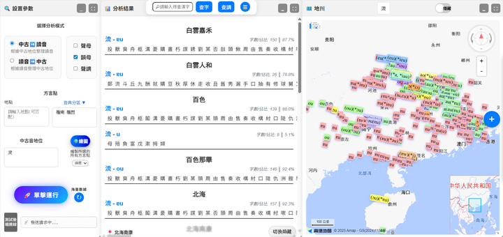

查詢泛閩西語的次濁上情況：

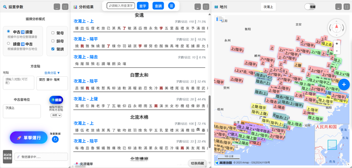

查詢湘贛及周邊的知三端讀情況：

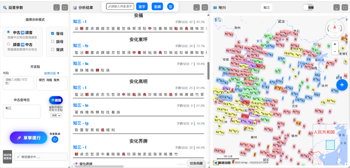

查詢全國的豪韻字，也不會卡，只是等待后端返回耗時稍久一點（大約61s）

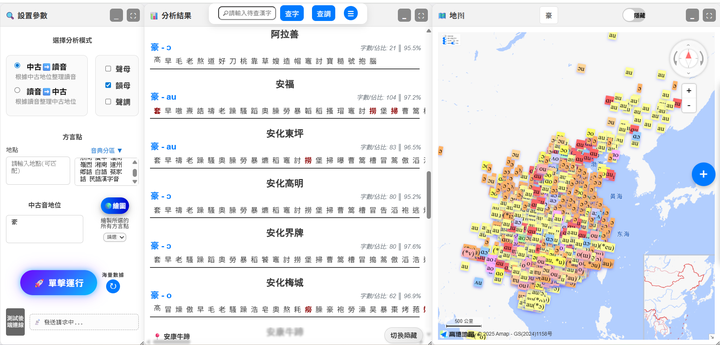

也可以放大地图，显示所有点（按音典一级分区标色）

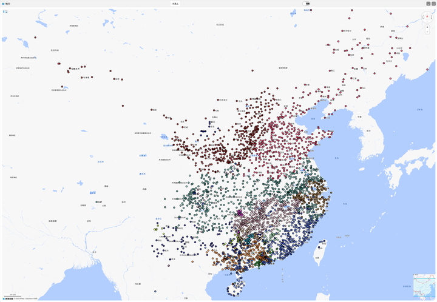

## 一、输入面板

#### 交互区

首先分为两个部分：**按照中古地位整理今音**；**根据今音查询该音位的中古来源**

选择要分析的**特征(声\韵\调)**

**地点输入框**：会自动连接后端查询匹配输入，并且用户可以点击选择。

具体匹配逻辑有：直接匹配、简体转繁体匹配、拼音模糊匹配、根据行政区划匹配(县、镇、村均可)、相似度匹配。

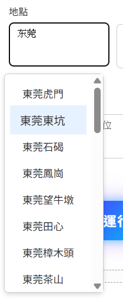

**分区输入：** 可输入或选择匹配的分区

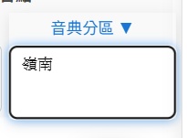

鼠标hover（悬浮）会自动弹出下一级分区选框，点击即选中并自动填入。

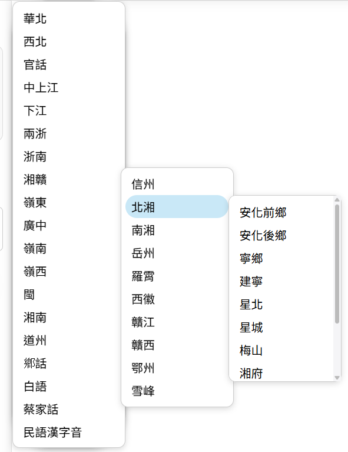

分区数据均是根据后端返回动态生成的，便于数据更新与维护。

### 1.1中古→读音

如果选中的是 中古地位整理读音 模式，那么可以选择输入中古音地位。

输入声\韵\调的名字：

- 输入「泥」→根据泥母分析；
- 输入「宕 江」→根据合并后的宕、江摄辖字分析（中间空格代表一起分析，回车则是按照不同特征处理）；
- 输入「次浊」→根据次浊声母进行分析；
- 输入「豪」→根据豪韵分析；
- 输入「庄组」→根据庄组分析(如果只输入庄，会根据庄母分析)；
- 输入「流开一」→根据流摄开口一等字分析
- 输入「假知组 假章组」→根据假摄的知章组辖字进行分析。

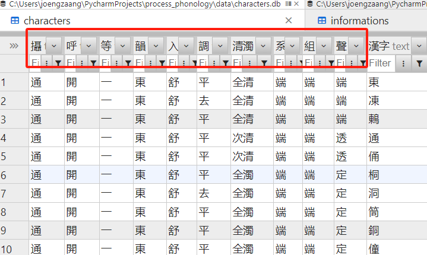

>  这些中古音地位都可以用来分析

例如，分析「嶺南」的宕摄舒声字

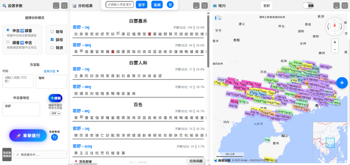

并且，支持“-”全匹配。（位于-后面的必须是中古地位某类）

例如：输入「蟹-等」，会自动匹配蟹一、蟹二、蟹三、蟹四等字。

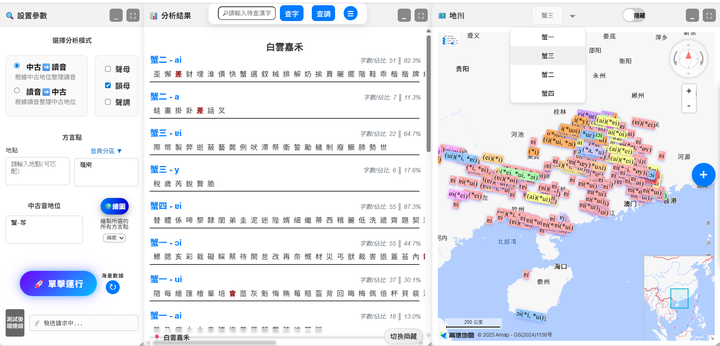

如果不输入：则自动根据待分析特征生成（声母：根据三十六声母整理；韵母：根据十六摄整理；声调：根据中古清浊+调类整理）

我为汉字、地名两列添加了索引，经过多次测试，查询200个点的某个韵摄，可以在5s内完成。

### 1.2读音→中古

（根据今音查询该音位的中古来源）

可以输入查询分类所用的中古音地位：

输入中古某类（声、摄、韵、等、呼、调、清浊、系、组），如果不输入，则根据查询特征自动分配（声母-声；韵母-摄；声调-清浊+调）

也可以输入待查音节，留空则查询全部音节。

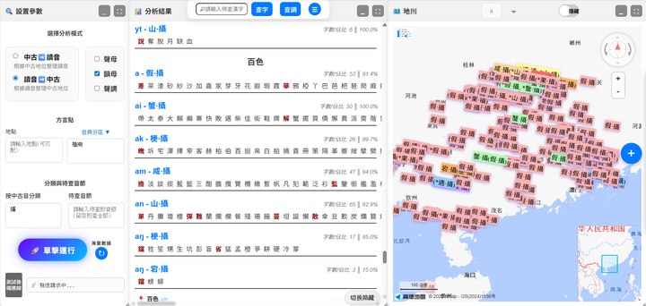

>  按摄整理岭南所有点的韵母

## 二、结果面板

设计了四种模式：

- 海量数据-隐藏模式；

- 海量数据-不隐藏模式；

- 表格-隐藏模式；

- 表格-不隐藏模式。

**隐藏模式**：隐藏字数较少、占比较低的语音特征。

### 2.1海量数据

基于段落标签
动态生成，并且加上了虚拟滚动懒加载，海量数据也不会卡。

**隐藏模式**：

**不隐藏模式：**

**一些花里胡哨的效果：**

**浮动bar**做了毛玻璃效果。地点名会根据当前所在区域自动切换，便于用户知道当前显示的语音特征来自于哪个地点。

**多音字效果**：

标红显示，鼠标悬浮会显示出所有音

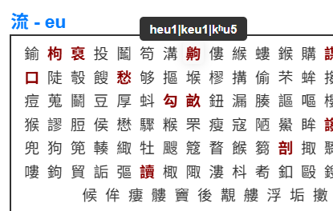

### 2.2表格模式

因为是基于flex=1渲染的<table>，需要全部渲染才能计算列宽，所以没做虚拟滚动效果，支持少量数据显示

**隐藏模式**（隐藏了地点、特征列）

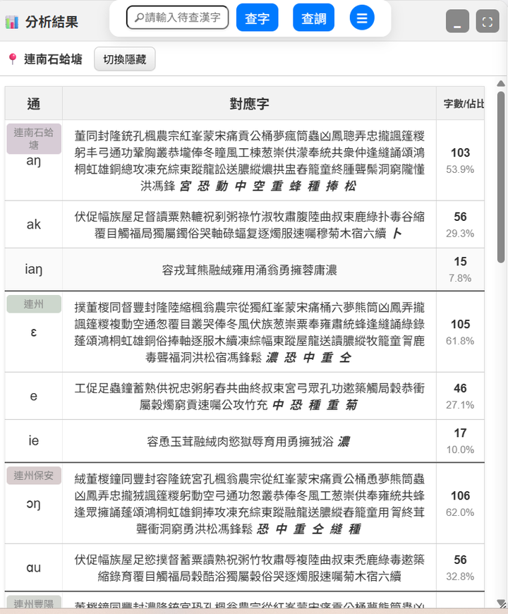

**不隐藏模式：**

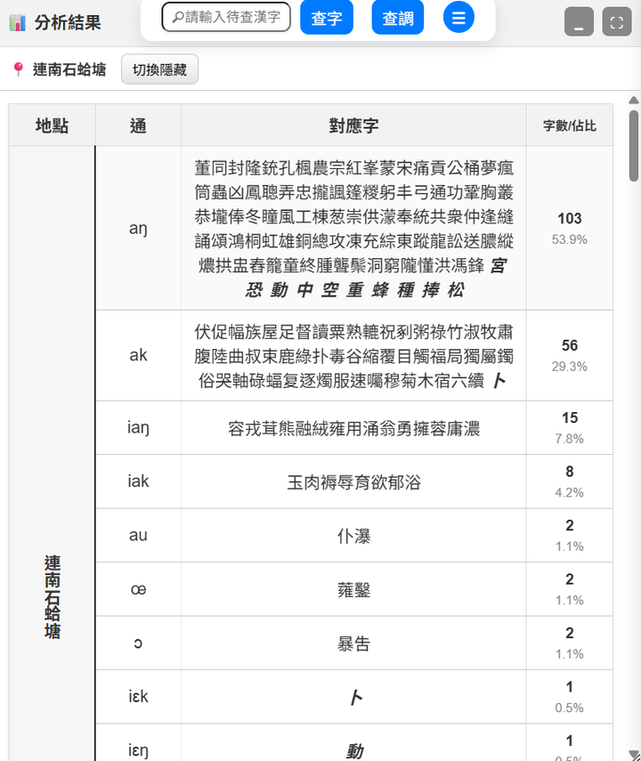

- 浮动bar同样可以根据当前所在位置自动切换；

- 多音字能hover显示详情。

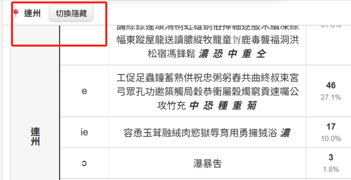

- 隐藏模式下，hover地点名 有加深效果

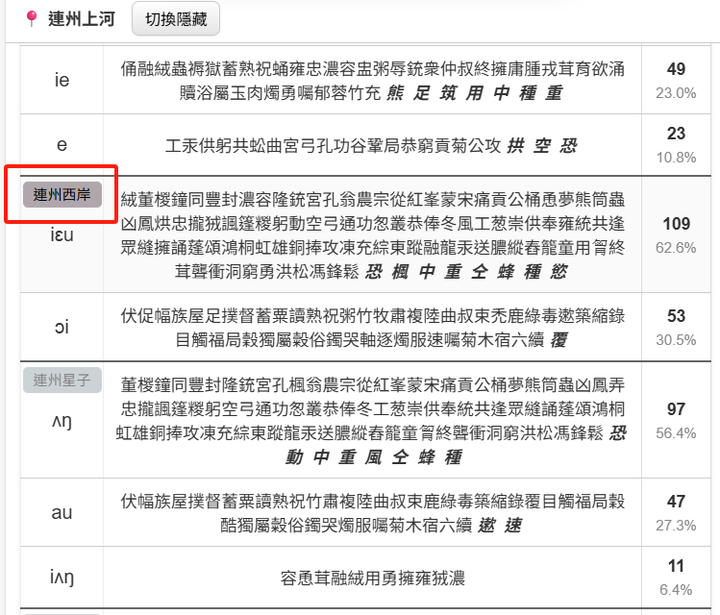

- 结果面板也可以全屏显示

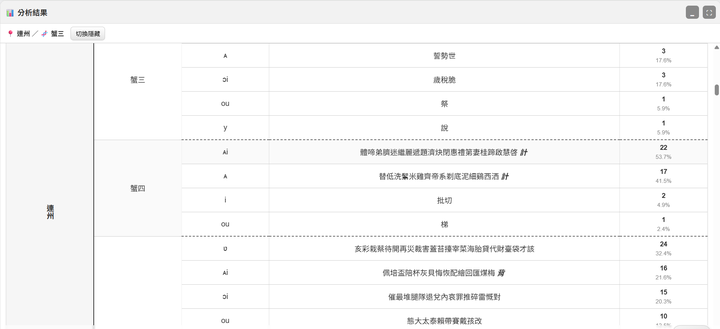

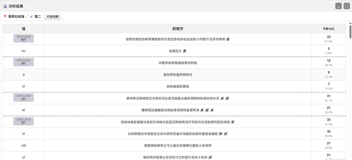

## 三、地图面板

调用的是高德api接口

### 3.1地点名称绘图

每次执行完查询，会自动绘制一幅以查询所得点的地名为标识的地图。

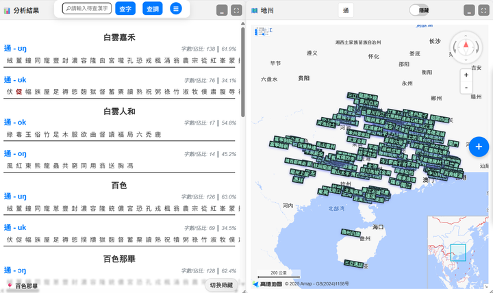

地图界面可以自由拖动、缩放，也可以全屏显示：

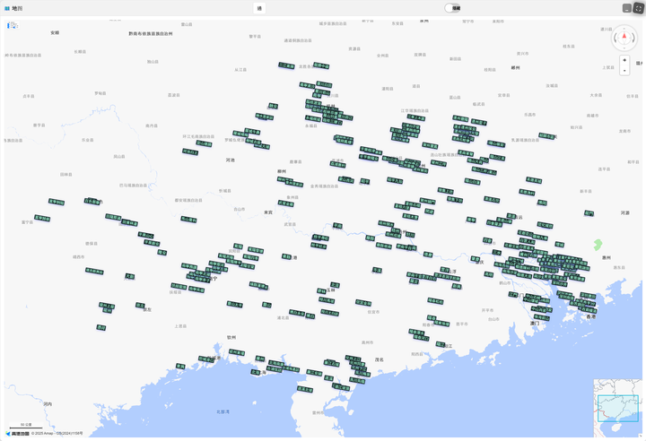

### 3.2特徵绘图

点击顶部栏的特征后，根据选择特征进行绘图

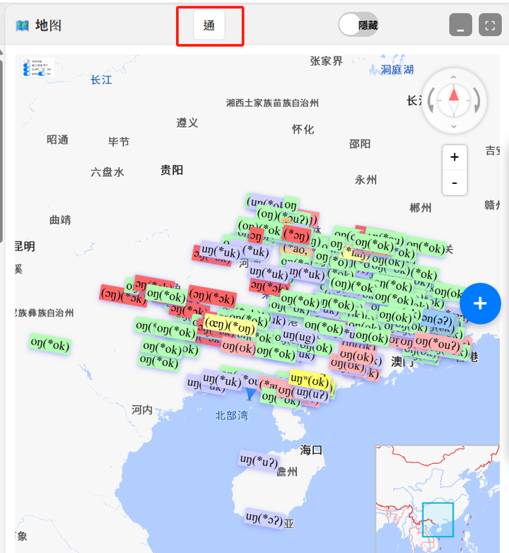

有多个特征时，会生成下拉选框供用户选择

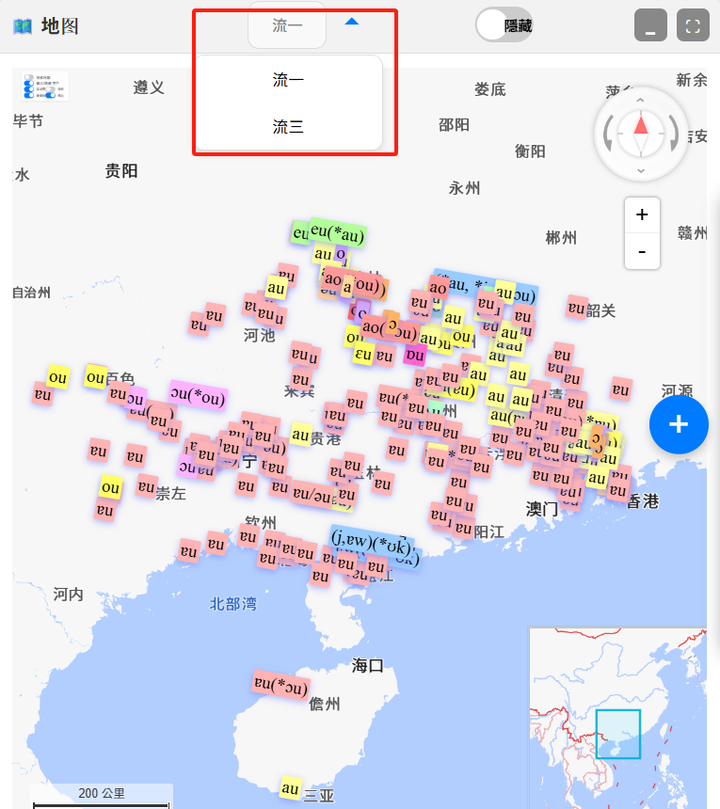

当然也支持全屏显示

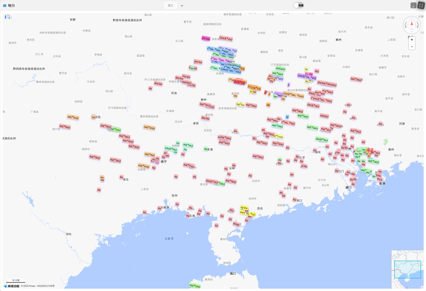

点击会浮现弹窗，列出该地点名称以及各特徵占比。

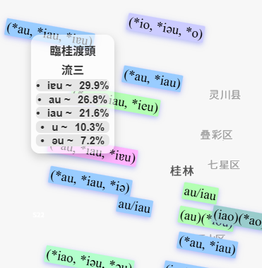

### 3.3分区绘图

按照分区绘图，可选择按照音典一级\二级\三级分区绘图。

按照音典二级分区绘制的岭南+岭西点图

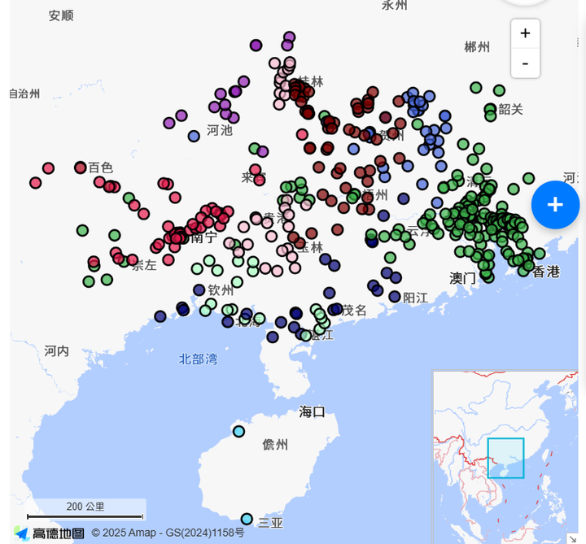

按照音典三级分区绘制的闽西点图

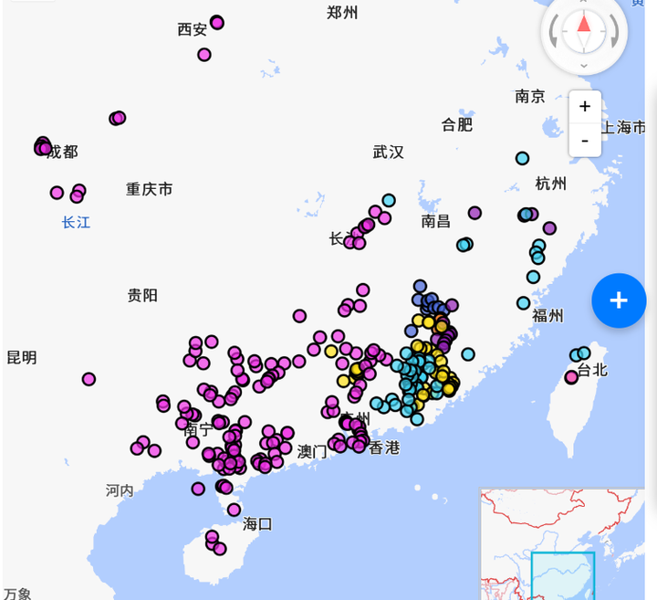

### 3.4自定义添加

支持用户个人添加点、特征，方便绘制地理语言学地图。

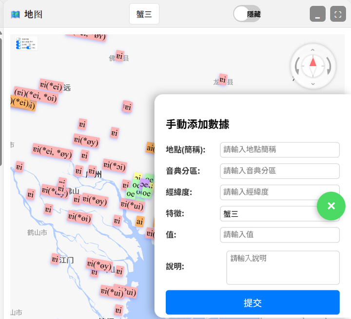

- 特徵根据当前绘图特徵自动填入
- 在手动添加数据框展开时，点击地图会自动获取经纬度填入
- 输入地点会自动到后端数据库匹配已有点，点击后自动填入该点分区（可以理解为填写音典分区的工具）

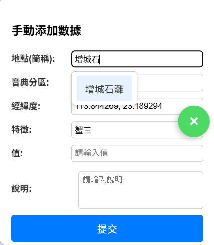

提交后打开顶部栏按钮，即可显示自己刚刚绘制的点。关闭则不显示，可自由切换

点击填入的点，会出现弹窗显示详细信息。

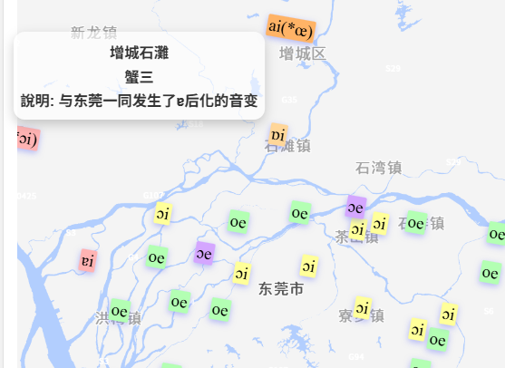

当然，如果我之后上云的话，肯定会搞登录制，只有登录了的人才能自己添加点

### 3.5地图控件切换

鼠标悬浮后，左上角控件区会自动放大，可以切换地图控件。

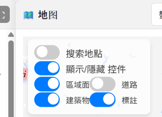

例如是否显示道路、标注、鹰眼等（来源于高德底图）。

也可以打开搜索地点窗口，输入关键字搜索。

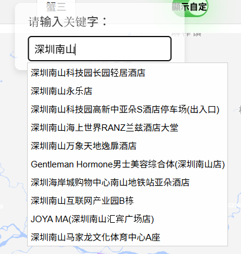

## 四、下拉面板(查字、调)

这是最后加上的小面板。

### 查字

查字只会显示读音和中古地位，详细的查字、注释功能移步音典。做这个简单的查字功能，是为了配合 根据今音查询该音位的中古来源 功能使用的。知道某个字的声韵调后，再去搜索查询该音位的中古来源，更加方便。

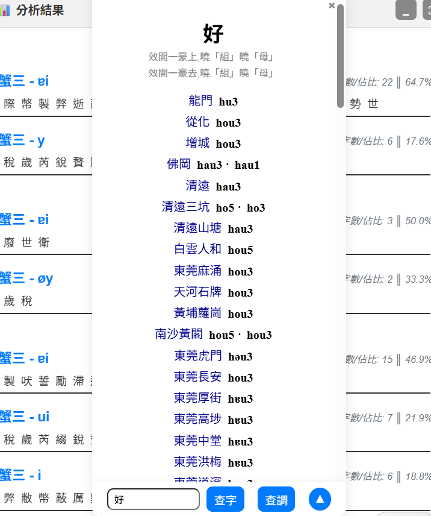

添加图片注释，不超过 140 字（可选）

窗口长度可以自由拖动，可以一次查询多个字。

### 查调

可以显示各调类的调值，并且填充了不同颜色。

- 有多个调类的，中间用,分隔
- 某个调类合并到了另一个调类，会填上另一个调类的颜色（前提是音典档案填得好，例如[5]陰去陽上，才会把阳上调填上阴去的颜色）
- 不存在的调类会留空

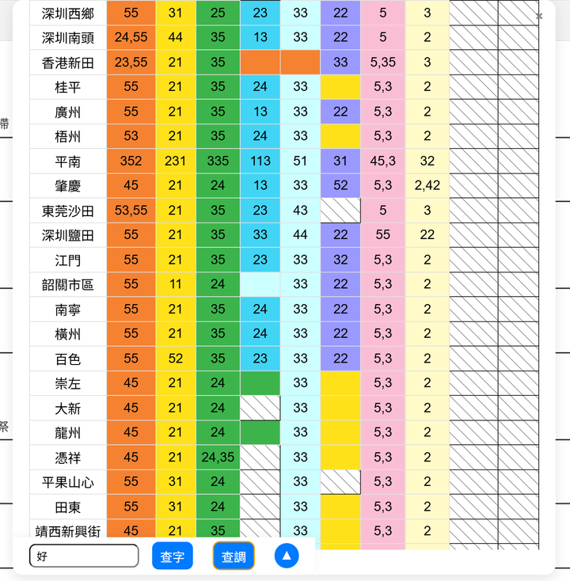

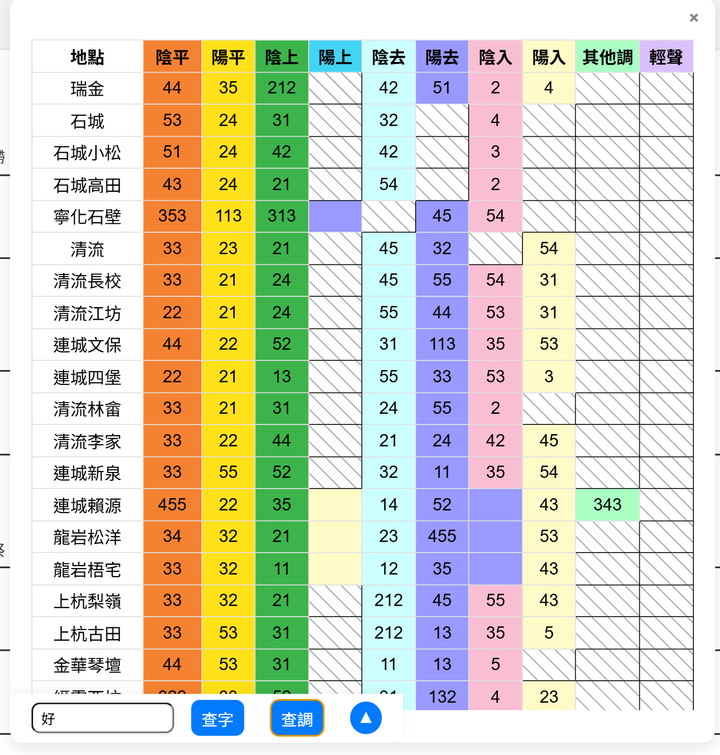

hover会放大，点击后可以显示具体的调类信息。

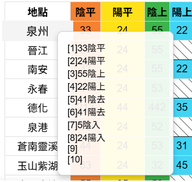

##  